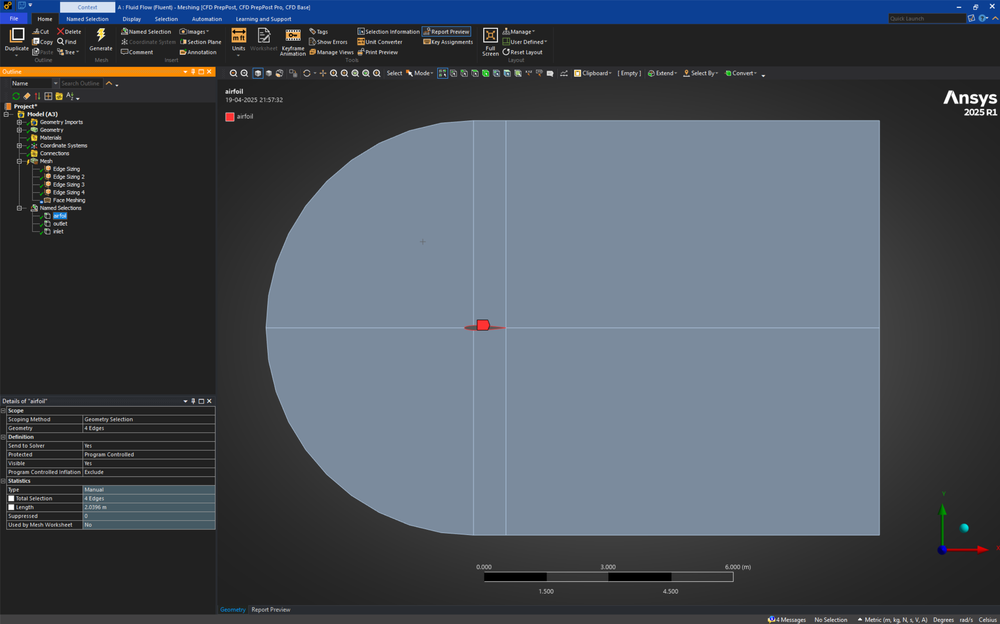
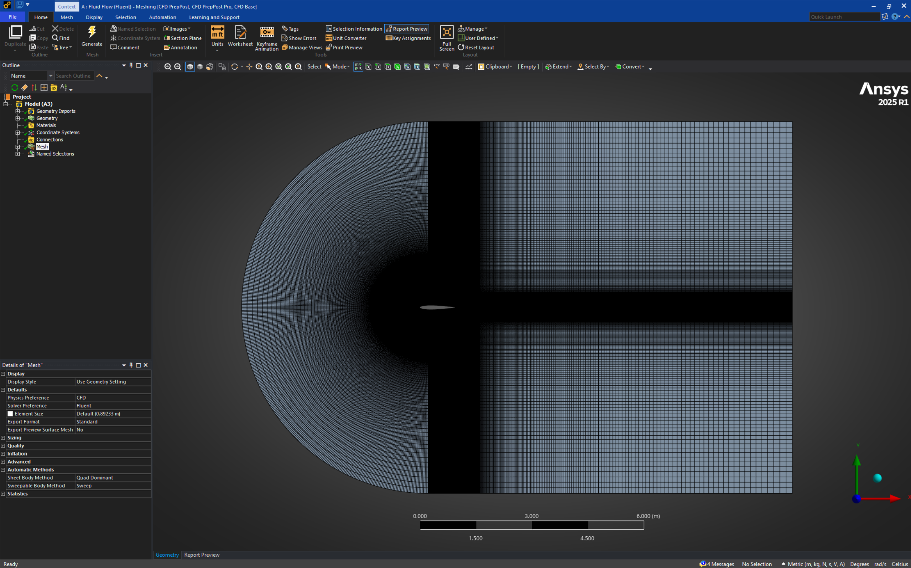

# CFD Analysis of NACA 0012 Airfoil  
**Course:** ME209 – Computational Fluid Dynamics  
**Author:** Deepak Gadhave  
**Date:** April 2025  

---

## 📝 Overview

This project involves a **CFD study of the NACA 0012 symmetric airfoil** at **0°** and **5° angles of attack** using **ANSYS Fluent 2024 R2**. The objective was to investigate flow behavior, streamline patterns, and aerodynamic characteristics such as lift and drag under steady, incompressible conditions.

---

## ⚙️ Workflow Summary

1. **Airfoil Geometry Generation**  
   - Coordinates generated using Airfoil Tools  
   - Embedded in a 2D C-type domain

   

     
   

2. **Domain Setup in ANSYS DesignModeler**  
   - Split into multiple regions for effective boundary condition application

   

     
   

3. **Structured C-grid Meshing**  
   - Quad-dominant elements  
   - y⁺ targeted near 1 for wall-resolved simulation  
   - Over 525,000 elements used

   

     
   

4. **Simulation in ANSYS Fluent**  
   - Turbulence model: k-ω SST  
   - Reynolds number: 1×10⁶  
   - Boundary conditions set for both angles of attack  

---

## 📊 Report Contents

  
  
  
 

The report contains:
- Step-by-step geometry and mesh generation
- Mesh quality metrics
- Fluent simulation setup
- Convergence plots
- Pressure, velocity, and streamline contours for both cases
- Lift and drag coefficient comparisons
- Validation with literature data

---

## 📁 File

- `ME209_CFD_Report_23110110.pdf`: Full report documenting geometry prep, meshing strategy, simulation configuration, and results with figures and analysis.

---

## 📚 References

- Abbott & von Doenhoff (1959)  
- Ladson (1988)  
- ANSYS Fluent User Guide  
- XFOIL Predictions

---
